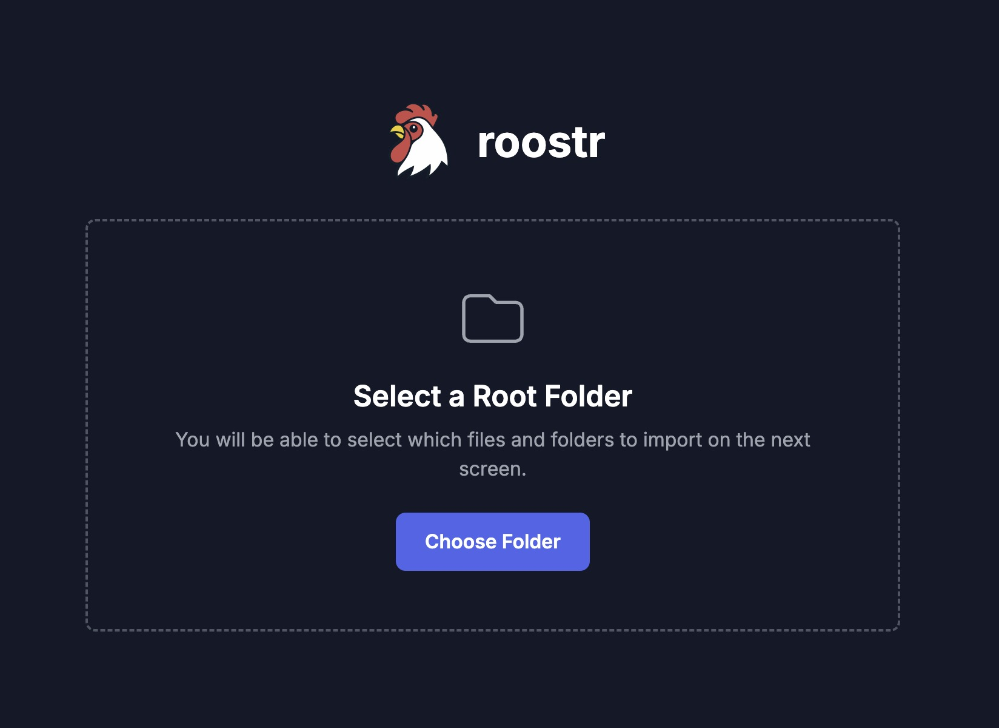

# Roostr 🐓

Roostr is a powerful, privacy-first, browser-based tool for creating dynamic photo and video collages from your local files. Select your media, arrange it in an interactive collage, and enjoy a seamless viewing experience, all without ever uploading a single file to a server.

## ✨ Core Concept: Privacy First

**Your files never leave your computer.** Roostr runs entirely in your web browser. All file processing, thumbnail generation, and collage creation happens locally on your machine. This means:

-   ✅ **100% Private:** No data is sent to any server.
-   ✅ **Works Offline:** Once the page is loaded, you can disconnect from the internet.
--   ✅ **No Sign-Up Required:** Just open the file and start creating.

## 🚀 Features

### File & Media Handling
-   **Multiple Input Methods:** Select files, entire folders, or simply drag and drop your media onto the page.
-   **Client-Side Processing:** Efficiently handles local files using modern browser APIs (`FileReader`, Object URLs).
-   **Automatic Thumbnail Generation:** Creates preview thumbnails for videos directly in the browser by capturing a frame on a `<canvas>` element.
-   **Tabbed Media Gallery:** Automatically organizes your imported files into "Photos" and "Videos" tabs with a masonry-style grid layout.

### Interactive Collage Creation
-   **Easy Selection:** Simply click on photos and videos in the gallery to add or remove them from your collage selection.
-   **Dynamic Layout:** The collage view uses a justified, flexbox-based layout that intelligently arranges media based on its original aspect ratio.
-   **Simultaneous Video Playback:** All videos in the collage autoplay silently in a loop, creating a lively, dynamic wall of media.
-   **Interactive Audio:** Click on any playing video in the collage to make it the single audible video. Click again to mute it.
-   **On-Demand Controls:** Hover over any video in the collage to reveal quick-access buttons for toggling audio and native video controls.

### Advanced Viewing Experience
-   **Modal Video Player:** Play any video from the gallery in a dedicated, full-screen modal player with standard controls.
-   **Keyboard Shortcuts:** Adjust the volume in the modal player using the `ArrowUp` and `ArrowDown` keys.
-   **Fullscreen Collage:** View the generated collage in a fullscreen modal for an immersive experience.

## 🛠️ How It Works

Roostr is a modern single-page application built with React, but it uses a **build-less setup**. This makes it incredibly simple to run and modify.

-   **React via CDN:** The application uses CDN links for React and ReactDOM, allowing the React library to be used without a local installation or build process.
-   **In-Browser JSX Transpilation:** The JavaScript code is written in JSX. The Babel Standalone CDN script transpiles this JSX into plain JavaScript on-the-fly, directly in the browser.
-   **Modern Browser APIs:** The app heavily relies on advanced web APIs for its functionality:
    -   `FileReader API` to read local file data.
    -   `URL.createObjectURL()` to create temporary, in-memory URLs for displaying media without uploading.
    -   `Canvas API` to programmatically draw a video frame and export it as an image for thumbnails.
    -   `File and Directory Entries API` to handle folder drag-and-drop operations.

## 💻 Technologies Used

-   **React 18** (via CDN)
-   **ReactDOM** (via CDN)
-   **Babel Standalone** (via CDN for in-browser JSX transpilation)
-   **Tailwind CSS** (via CDN)
-   **Vanilla JavaScript (ES6+)** and modern browser APIs

## 🚀 Getting Started

Because Roostr requires no build step, getting started is immediate.

1.  **Clone or Download:** Get a local copy of the repository.
2.  **Open the File:** Open the `index.html` file in a modern, Chromium-based web browser (like Google Chrome, Microsoft Edge, Brave, or Opera) for the best compatibility with the File and Directory Entries API.

That's it! The application will load and be ready to use.

### Usage Guide

1.  Drag and drop files or folders onto the main dropzone, or use the "Select Files" / "Select Folder" buttons.
2.  Wait for the processing to complete. The app will generate thumbnails and sort your media.
3.  Switch between the "Photos" and "Videos" tabs to view your imported media.
4.  Click on any image or video to select it for the collage. Selected items will have a blue border.
5.  When you're ready, click the **"Create & View Collage"** button.
6.  Interact with your collage! Click videos to toggle sound, or use the buttons to go back, add more media, or view the collage in fullscreen.

## ⚠️ Limitations

-   **Browser Compatibility:** Full functionality, especially folder selection and drag-and-drop, is best on Chromium-based browsers due to reliance on the non-standard File and Directory Entries API.
-   **Performance:** Processing a very large number of files, or very large high-resolution video files, may be resource-intensive and could slow down the browser tab.
-   **No State Persistence:** The application state is not saved. Reloading the page will clear all imported media.
-   **No Export:** This version does not include functionality to save or export the final collage.

## 📄 License

This project is open source and available under the [MIT License](LICENSE).
  
